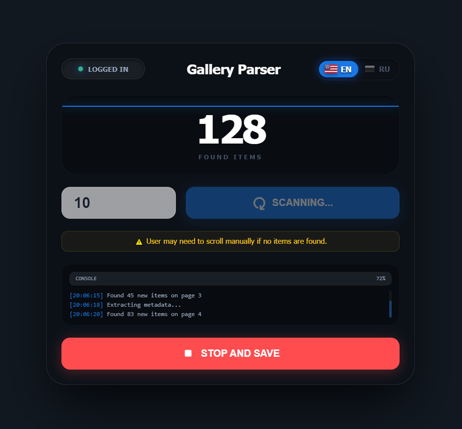

# Civitai Gallery Parser Extension

[English](README.en.md) · [Русский](README.md)

A Chrome extension for parsing and collecting data on images from user galleries on Civitai.com and its mirror Civitai.red. All operations are handled through a stylish **Unified Overlay** injected directly into the website page.

## Features:

- **Unified Overlay**: Modern, animated control panel right on the Civitai page. No need for separate popup windows.
- **Smart Scanner (v1.5+)**: Advanced algorithm with auto-scroll unlocking, modal bypass, and deep action simulation for maximum image detection (49+ per page).
- **Civitai.red Mirror Support**: Ability to scan on the `civitai.red` mirror domain just like the main site.
- **Live Counter Animation**: Real-time smooth ticking of found image counts using Cubic-Out easing.
- **Change Tracking**: Automatically detects **new**, **changed** (both reaction count increases and decreases marked with clear color indicators), and **removed** images compared to previous sessions.
- **Results Visualization**: Full-featured results page with filters, detailed statistics, and export options.
- **Generation Prompt Extraction (v1.6+)**: Automatic collection of image descriptions (prompts) directly from Civitai pages in the background.
- **Excel Export/Import**: Save data to a clean XLSX file containing a single "Gallery Data" sheet. The list of removed items is calculated dynamically on the fly during import, and the "Prompt" column is automatically saved in the spreadsheet.
- **Excel Filename Suffixes**: Tables are automatically saved with `_red` (for civitai.red) or `_com` (for civitai.com) suffix at the end of the filename.
- **Multilingual UI**: Full English and Russian support with animated flag switchers.

## Installation:

1.  **Download** this extension to a folder on your computer.
2.  Open Google Chrome and navigate to `chrome://extensions/`.
3.  Enable **"Developer mode"** in the top right corner.
4.  Click the **"Load unpacked"** button.
5.  Select the folder containing the project files (`manifest.json` and others).
6.  The extension will appear in the list and on the browser toolbar.

## How to Use:

1.  Navigate to a user's gallery page (e.g., `https://civitai.com/user/beg0n/images` or `https://civitai.red/user/beg0n/images`).
2.  Click the extension icon in the browser toolbar. The **Control Overlay** will appear on the Civitai page.
3.  Select your preferred language (RU/EN) using the **flag switcher in the top right corner of the overlay** if needed.
4.  Set the number of scrolling pages and click the **"SCAN"** button. To abort at any time, click the **"STOP"** button — data from the current session will be discarded.
5.  Monitor the logs in the overlay terminal and watch the live counter. The scanner will also stop **automatically** if 3 consecutive iterations find no new images.
6.  Once complete, the overlay closes, the page refreshes, and a new tab opens with your results.

## On the Results Page You Can:

- Use the filters in the center of the footer: **"All"**, **"New"**, **"Changed"**, **"Removed"** (the footer is locked and always visible at the bottom of the screen).
- Click the info button **"i"** in the top-left corner of the image card to open a modal overlay with the detailed generation parameters (prompt) and copy it via the copy icon in the top-right corner of the modal (dismiss by clicking outside the modal).
- Click the **"Zero Reactions"** icon (crossed-out circle) to filter and show only images with zero total stats.
- Toggle reaction display mode using the **Smile icon** (detailed emojis or total score).
- Use icons in the left side of the footer for **Importing** or **Exporting** data to Excel (the "Prompt" column is saved automatically).
- Click the **"Top"** button (arrow) in the footer block on the right for quick scrolling.
- Click on any image to open the original on Civitai (the URL preview is hidden for better aesthetics).
- Cards are sorted by recency (**newest images are shown first**).
- Use the **"×"** (close tab) button in the top right corner of the header to close the results page.

## Notes:

- On the first scan of an author's gallery, all images will be marked as "New". On subsequent scans, the comparison logic will work.
- Civitai frequently updates its interface. If parsing stops working, the CSS selectors may have changed.
- **Login Status**: It is recommended to be logged into Civitai while scanning. For guests, some content (especially NSFW) may be hidden or restricted by the site.
- Keep the Civitai user gallery tab active and visible during scanning. Switching tabs or minimizing the browser may cause images to be missed due to lazy loading.
